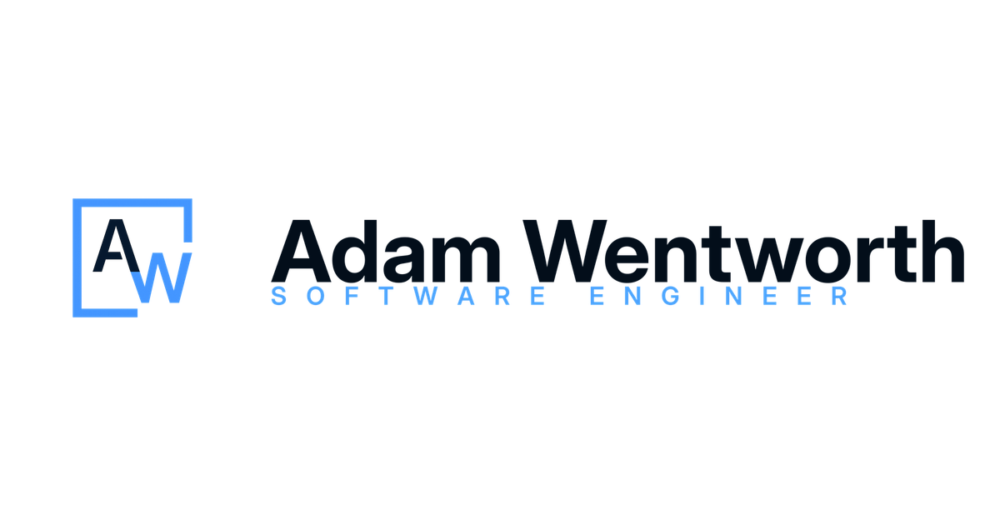
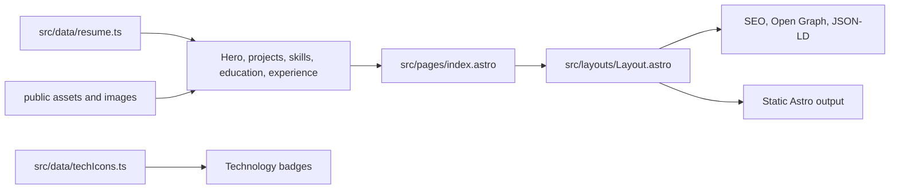

# AdamWentworth.ca - Resume And Portfolio Site

AdamWentworth.ca is the personal resume and project portfolio site for Adam Wentworth. It is a static Astro site built to present resume highlights, selected engineering case studies, technical skills, education, experience, contact links, SEO metadata, and a downloadable PDF resume in one fast public surface.

The site complements [phlosion.com](https://phlosion.com): AdamWentworth.ca focuses on recruiting context and background, while Phlosion presents the broader product-lab view of individual software builds.

---

## Brand Surface

| Social card                                                     | Adam Wentworth lockup                                     |
| --------------------------------------------------------------- | --------------------------------------------------------- |
|  |  |

Brand and social assets live in `public/assets/`. Resume and favicon assets live in `public/`, and the project/credential imagery used by the page lives in `public/images/`.

---

## App Structure

```plaintext
Resume/
|-- public/
|   |-- assets/                # Adam Wentworth brand marks and social card
|   |-- images/                # Portrait, education logos, local tech marks
|   |-- resume.pdf             # Downloadable resume PDF
|   |-- robots.txt             # Sitemap reference for crawlers
|   `-- favicon*               # Browser and mobile icons
|-- src/
|   |-- components/            # Hero, sections, cards, badges, footer
|   |-- data/                  # Resume content and tech icon mappings
|   |-- layouts/               # Shared HTML metadata and structured data shell
|   |-- pages/                 # Astro page routes
|   `-- styles/                # Global CSS and responsive layout rules
|-- .github/workflows/ci.yml   # Lint, test, and build workflow
|-- astro.config.mjs           # Astro sitemap config for adamwentworth.ca
|-- package.json               # Scripts and dependencies
`-- README.md
```

The repo is intentionally content-driven. Most resume changes should happen in `src/data/resume.ts`, with components and styles changing only when the presentation model changes.

---

## Tech Stack Overview

| Layer     | Tech                                             | Notes                                                             |
| --------- | ------------------------------------------------ | ----------------------------------------------------------------- |
| Framework | Astro                                            | Static site generation with a lightweight component model         |
| Language  | TypeScript                                       | Typed resume data and content contract tests                      |
| Styling   | Plain CSS                                        | Global responsive styles in `src/styles/global.css`               |
| Metadata  | Astro layout, JSON-LD, Open Graph, Twitter cards | Person structured data, canonical URL, social preview card        |
| Assets    | Public static assets                             | Brand marks, portrait, education logos, tech icons, PDF resume    |
| Testing   | Vitest                                           | Contract tests for resume data, links, assets, icons, and anchors |
| Quality   | Astro Check, Prettier, GitHub Actions            | `npm run verify` runs lint, tests, and production build           |
| Hosting   | Vercel-ready static output                       | Production site target is `adamwentworth.ca`                      |

---

## Product Surface

- **Hero and summary**: name lockup, role, location, profile facts, career intent, portrait, resume PDF, email, LinkedIn, and GitHub links.
- **Project case studies**: selected engineering work with role framing, proof points, technology badges, and GitHub links.
- **Technical skills**: grouped matrix for languages, frontend/desktop, backend/API work, data/infrastructure, systems/games, AI/automation, and fundamentals.
- **Education**: credential cards for current and completed education with local logo assets.
- **Experience timeline**: client projects, support work, data operations, studio work, and creator experience presented as practical career context.
- **Contact footer**: direct email and external profile links.
- **SEO/social layer**: canonical metadata, profile Open Graph tags, Twitter card metadata, sitemap output, robots file, and JSON-LD Person data.

---

## Content Model

`src/data/resume.ts` is the primary content source. It defines:

| Field                                          | Purpose                                                                           |
| ---------------------------------------------- | --------------------------------------------------------------------------------- |
| `name`, `role`, `location`, `siteUrl`, `email` | Primary identity and contact metadata                                             |
| `summary`, `intro`, `impact`, `profileFacts`   | Hero and profile copy                                                             |
| `resumePdf`                                    | Downloadable PDF resume link                                                      |
| `links`                                        | Email, LinkedIn, GitHub, and prominent contact actions                            |
| `experience`                                   | Timeline entries with highlights, companies, periods, and technologies            |
| `projects`                                     | Case-study cards with summaries, proof points, technologies, and repository links |
| `skills`                                       | Grouped skill matrix                                                              |
| `education`                                    | Credential cards and logo assets                                                  |

`src/data/techIcons.ts` maps visible technology labels to simple-icons, local images, or custom inline SVG-style shapes. The contract test checks that every visible badge has icon coverage.

---

## Getting Started

### 1. Install Dependencies

```bash
npm install
```

### 2. Start Local Development

```bash
npm run dev
```

Open:

- Local site: `http://localhost:4321`

### 3. Preview A Production Build

```bash
npm run build
npm run preview
```

---

## Local Checks

| Command                | Purpose                               |
| ---------------------- | ------------------------------------- |
| `npm run check`        | Run Astro type/content checks         |
| `npm run format`       | Format the repo with Prettier         |
| `npm run format:check` | Verify formatting without writing     |
| `npm run lint`         | Run Astro check and formatting check  |
| `npm run test`         | Run Vitest contract tests             |
| `npm run build`        | Build the static Astro output         |
| `npm run verify`       | Run lint, tests, and production build |

The normal pre-commit confidence path is:

```bash
npm run verify
```

CI runs the same core gate on pushes and pull requests to `main`: install dependencies, lint, test, and build.

---

## Data Flow



The site has no runtime database or backend. Resume content, icon mappings, assets, and metadata are compiled into static output.

---

## Editing Workflow

### Update Resume Content

Edit `src/data/resume.ts` for:

- profile summary and hero copy
- project case studies
- work experience entries
- skill groups
- education and credential details
- contact links and resume PDF path

### Update The Resume PDF

Replace:

```plaintext
public/resume.pdf
```

Then run:

```bash
npm run verify
```

### Add A New Technology Badge

1. Add the visible label in `src/data/resume.ts`.
2. Add icon coverage in `src/data/techIcons.ts`.
3. Add any required local image asset under `public/images/`.
4. Run `npm run test` to confirm the contract test sees full badge coverage.

---

## Environment Overview

The site does not require runtime environment variables for local development or production rendering.

| Setting             | Location            | Purpose                                                                   |
| ------------------- | ------------------- | ------------------------------------------------------------------------- |
| `site`              | `astro.config.mjs`  | Sets canonical site URL and sitemap output for `https://adamwentworth.ca` |
| `public/robots.txt` | Static public asset | Points crawlers at the sitemap index                                      |
| `public/resume.pdf` | Static public asset | Downloadable resume linked from the hero                                  |

---

## Deployment

AdamWentworth.ca is built as static Astro output and is ready for Vercel deployment.

Typical deployment flow:

1. Push to GitHub.
2. Vercel installs dependencies and runs `npm run build`.
3. The custom domain points to the Vercel project.
4. Sitemap and robots output use `https://adamwentworth.ca`.
5. Social preview metadata uses `public/assets/aw-social-card.png`.

---

## Author Notes

This repo is the recruiting and resume layer of the portfolio. It is built to stay fast, direct, scannable, and honest: a recruiter should be able to understand the candidate profile quickly, then follow project links for deeper technical evidence.
