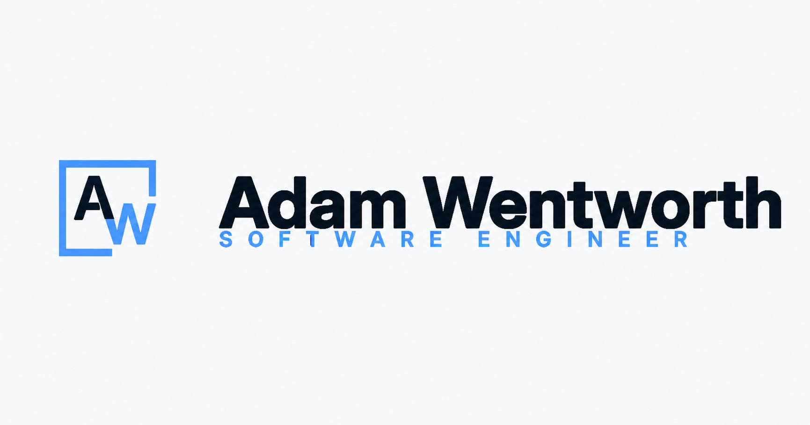
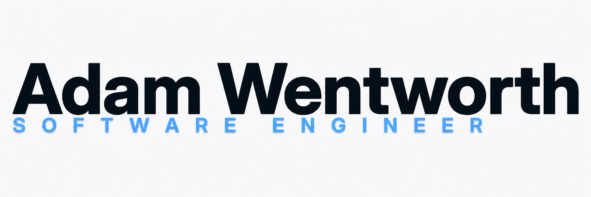
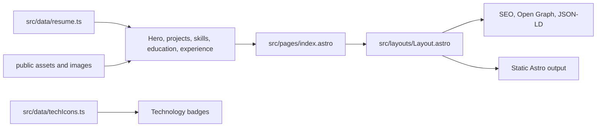

# AdamWentworth.ca — Resume & Portfolio

## About

I built AdamWentworth.ca as my personal resume and project portfolio. It brings together my resume highlights, selected engineering case studies, technical skills, education, experience, contact links, and downloadable PDF resume in one fast, accessible site.

This site complements [phlosion.com](https://phlosion.com): I use AdamWentworth.ca to share my professional background and recruiting context, while Phlosion is my broader product lab for individual software builds.

## Tech Stack

[](https://astro.build/)
[](https://www.typescriptlang.org/)
[](https://developer.mozilla.org/docs/Web/CSS)
[](https://vitest.dev/)
[](https://prettier.io/)
[](https://vercel.com/)

| Layer     | Technology                                       | How I use it                                                       |
| --------- | ------------------------------------------------ | ------------------------------------------------------------------ |
| Framework | Astro                                            | Generate a fast, lightweight static site                           |
| Language  | TypeScript                                       | Type my resume data and content contract tests                     |
| Styling   | Plain CSS                                        | Build the responsive design in `src/styles/global.css`             |
| Metadata  | Astro layout, JSON-LD, Open Graph, Twitter cards | Publish structured data, canonical URLs, and social previews       |
| Assets    | Public static assets                             | Serve my brand marks, portrait, education logos, icons, and resume |
| Testing   | Vitest                                           | Check my resume data, links, assets, icons, and anchors            |
| Quality   | Astro Check, Prettier, GitHub Actions            | Run linting, tests, and the production build                       |
| Hosting   | Vercel                                           | Deploy the static output to `adamwentworth.ca`                     |

---

## Brand Surface

| Social card                                                            | Adam Wentworth lockup                                            |
| ---------------------------------------------------------------------- | ---------------------------------------------------------------- |
|  |  |

I keep brand and social assets in `public/assets/`, resume and favicon assets in `public/`, and project and credential imagery in `public/images/`. The `*-readme.png` previews use an opaque light panel so the dark lettering stays readable in both GitHub themes; the transparent production artwork remains unchanged.

---

## App Structure

```plaintext
Resume/
|-- RESUME.md                # Generated Markdown resume
|-- public/
|   |-- assets/                # Adam Wentworth brand marks and social card
|   |-- images/                # Portrait, education logos, local tech marks
|   |-- resume.pdf             # Downloadable resume PDF
|   |-- robots.txt             # Sitemap reference for crawlers
|   `-- favicon*               # Browser and mobile icons
|-- src/
|   |-- components/            # Hero, sections, cards, badges, footer
|   |-- data/                  # Resume content and tech icon mappings
|   |-- layouts/               # Shared HTML metadata and structured data shell
|   |-- pages/                 # Astro page routes
|   `-- styles/                # Global CSS and responsive layout rules
|-- .github/workflows/ci.yml   # Lint, test, and build workflow
|-- astro.config.mjs           # Astro sitemap config for adamwentworth.ca
|-- package.json               # Scripts and dependencies
`-- README.md
```

I keep the repo intentionally content-driven. I make most resume changes in `src/data/resume.ts` and update components or styles only when the presentation model needs to change.

---

## Product Surface

- **Hero and summary**: name lockup, role, location, profile facts, career intent, portrait, resume PDF, email, LinkedIn, and GitHub links.
- **Project case studies**: selected engineering work with role framing, proof points, technology badges, and GitHub links.
- **Technical skills**: grouped matrix for languages, frontend/desktop, backend/API work, data/infrastructure, systems/games, AI/automation, and fundamentals.
- **Education**: credential cards for current and completed education with local logo assets.
- **Experience timeline**: client projects, support work, data operations, studio work, and creator experience presented as practical career context.
- **Contact footer**: direct email and external profile links.
- **SEO/social layer**: canonical metadata, profile Open Graph tags, Twitter card metadata, sitemap output, robots file, and JSON-LD Person data.

---

## Content Model

`src/data/resume.ts` is my primary content source. It defines:

| Field                                          | Purpose                                                                           |
| ---------------------------------------------- | --------------------------------------------------------------------------------- |
| `name`, `role`, `location`, `siteUrl`, `email` | Primary identity and contact metadata                                             |
| `summary`, `intro`, `impact`, `profileFacts`   | Hero and profile copy                                                             |
| `resumePdf`                                    | Downloadable PDF resume link                                                      |
| `links`                                        | Email, LinkedIn, GitHub, and prominent contact actions                            |
| `experience`                                   | Timeline entries with highlights, companies, periods, and technologies            |
| `projects`                                     | Case-study cards with summaries, proof points, technologies, and repository links |
| `skills`                                       | Grouped skill matrix                                                              |
| `education`                                    | Credential cards and logo assets                                                  |

`src/data/techIcons.ts` maps my visible technology labels to simple-icons, local images, or custom inline SVG-style shapes. A contract test checks that every visible badge has icon coverage.

---

## Getting Started

### 1. Install Dependencies

```bash
npm install
```

### 2. Start Local Development

```bash
npm run dev
```

Open:

- Local site: `http://localhost:4321`

### 3. Preview A Production Build

```bash
npm run build
npm run preview
```

---

## Local Checks

| Command                | Purpose                               |
| ---------------------- | ------------------------------------- |
| `npm run check`        | Run Astro type/content checks         |
| `npm run format`       | Format the repo with Prettier         |
| `npm run format:check` | Verify formatting without writing     |
| `npm run lint`         | Run Astro check and formatting check  |
| `npm run resume`       | Regenerate `RESUME.md` and PDF resume |
| `npm run resume:md`    | Regenerate the Markdown resume        |
| `npm run resume:pdf`   | Regenerate the downloadable PDF       |
| `npm run test`         | Run Vitest contract tests             |
| `npm run build`        | Build the static Astro output         |
| `npm run verify`       | Run lint, tests, and production build |

Before I commit, I normally run:

```bash
npm run verify
```

My CI workflow runs the same core gate on pushes and pull requests to `main`: install dependencies, lint, test, and build.

---

## Data Flow



I do not use a runtime database or backend for this site. Astro compiles my resume content, icon mappings, assets, and metadata into static output.

---

## How I Maintain the Site

### Update Resume Content

Edit `src/data/resume.ts` for:

- profile summary and hero copy
- project case studies
- work experience entries
- skill groups
- education and credential details
- contact links and resume PDF path

### Update Resume Documents

I generate the website, Markdown resume, and PDF resume from repo-local sources:

- `src/data/resume.ts` holds the primary site content.
- `scripts/resume-document.mjs` holds the condensed print/Markdown resume selections.
- `RESUME.md` is generated Markdown.
- `public/resume.pdf` is generated from a local HTML print layout.

Then run:

```bash
npm run resume
npm run verify
```

### Add A New Technology Badge

1. Add the visible label in `src/data/resume.ts`.
2. Add icon coverage in `src/data/techIcons.ts`.
3. Add any required local image asset under `public/images/`.
4. Run `npm run test` to confirm the contract test sees full badge coverage.

---

## Environment Overview

I do not need runtime environment variables for local development or production rendering.

| Setting             | Location            | Purpose                                                                   |
| ------------------- | ------------------- | ------------------------------------------------------------------------- |
| `site`              | `astro.config.mjs`  | Sets canonical site URL and sitemap output for `https://adamwentworth.ca` |
| `public/robots.txt` | Static public asset | Points crawlers at the sitemap index                                      |
| `public/resume.pdf` | Static public asset | Downloadable resume linked from the hero                                  |

---

## Deployment

I build AdamWentworth.ca as static Astro output and deploy it with Vercel.

My typical deployment flow:

1. Push to GitHub.
2. Vercel installs dependencies and runs `npm run build`.
3. The custom domain points to the Vercel project.
4. Sitemap and robots output use `https://adamwentworth.ca`.
5. Social preview metadata uses `public/assets/aw-social-card.png`.

---

## Why I Built It

This site is the recruiting and resume layer of my portfolio. I designed it to stay fast, direct, scannable, and honest: a recruiter should be able to understand who I am and what I build quickly, then follow my project links for deeper technical evidence.
